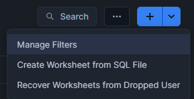
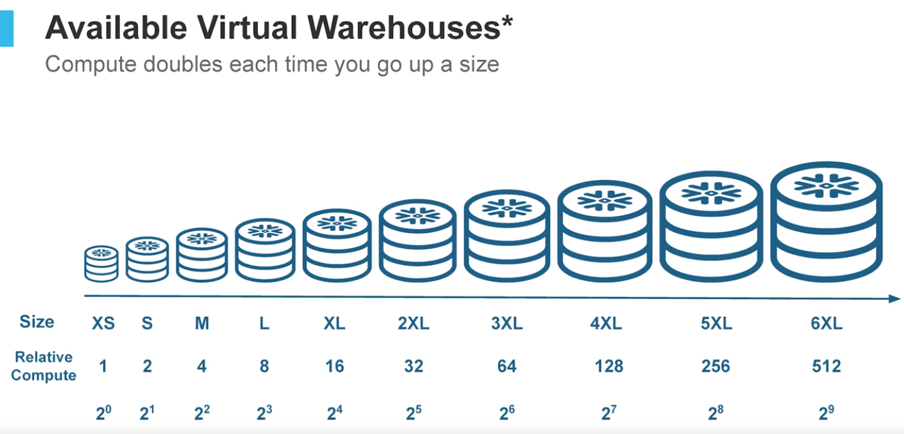
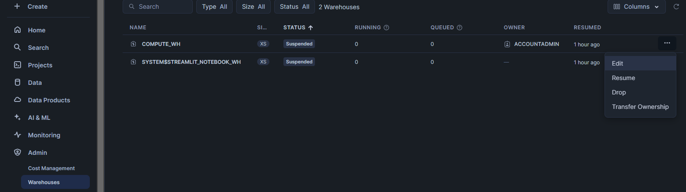
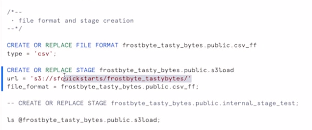
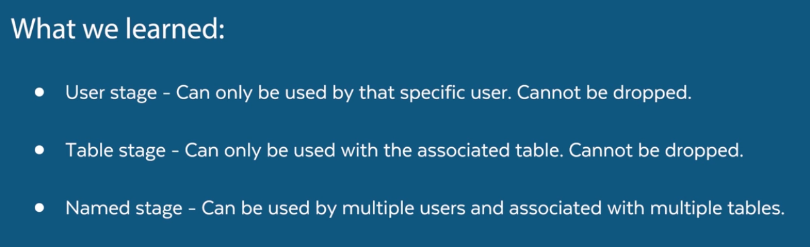
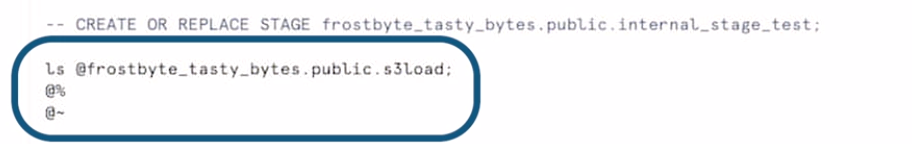
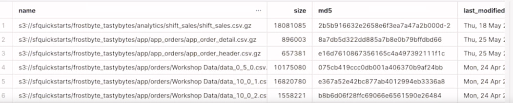

# Intro to Snowflake for Devs, Data Scientists, Data Engineers

You can create a new or upload existing Worksheet in the top right corner:



## Ingestion One Table:

The following code is an example of how to create a table with data (Run All):

```
USE ROLE accountadmin;

USE WAREHOUSE compute_wh;


---> create the Tasty Bytes Database
CREATE OR REPLACE DATABASE tasty_bytes_sample_data;

---> create the Raw POS (Point-of-Sale) Schema
CREATE OR REPLACE SCHEMA tasty_bytes_sample_data.raw_pos;

---> create the Raw Menu Table
CREATE OR REPLACE TABLE tasty_bytes_sample_data.raw_pos.menu
(
    menu_id NUMBER(19,0),
    menu_type_id NUMBER(38,0),
    menu_type VARCHAR(16777216),
    truck_brand_name VARCHAR(16777216),
    menu_item_id NUMBER(38,0),
    menu_item_name VARCHAR(16777216),
    item_category VARCHAR(16777216),
    item_subcategory VARCHAR(16777216),
    cost_of_goods_usd NUMBER(38,4),
    sale_price_usd NUMBER(38,4),
    menu_item_health_metrics_obj VARIANT
);

---> create the Stage referencing the Blob location and CSV File Format
CREATE OR REPLACE STAGE tasty_bytes_sample_data.public.blob_stage
url = 's3://sfquickstarts/tastybytes/'
file_format = (type = csv);

---> query the Stage to find the Menu CSV file
LIST @tasty_bytes_sample_data.public.blob_stage/raw_pos/menu/;

---> copy the Menu file into the Menu table
COPY INTO tasty_bytes_sample_data.raw_pos.menu
FROM @tasty_bytes_sample_data.public.blob_stage/raw_pos/menu/;
```
## Warehouses
```
---> what menu items does the Freezing Point brand sell?
SELECT 
   menu_item_name
FROM tasty_bytes_sample_data.raw_pos.menu
WHERE truck_brand_name = 'Freezing Point';

---> what is the profit on Mango Sticky Rice?
SELECT 
   menu_item_name,
   (sale_price_usd - cost_of_goods_usd) AS profit_usd
FROM tasty_bytes_sample_data.raw_pos.menu
WHERE 1=1
AND truck_brand_name = 'Freezing Point'
AND menu_item_name = 'Mango Sticky Rice';

CREATE WAREHOUSE warehouse_dash;
CREATE WAREHOUSE warehouse_gilberto;

SHOW WAREHOUSES;

USE WAREHOUSE warehouse_gilberto;

---> set warehouse size to medium
ALTER WAREHOUSE warehouse_dash SET warehouse_size=MEDIUM;

USE WAREHOUSE warehouse_dash;

SELECT
    menu_item_name,
   (sale_price_usd - cost_of_goods_usd) AS profit_usd
FROM tasty_bytes_sample_data.raw_pos.menu
ORDER BY 2 DESC;

---> set warehouse size to xsmall
ALTER WAREHOUSE warehouse_dash SET warehouse_size=XSMALL;

---> drop warehouse
DROP WAREHOUSE warehouse_vino;

SHOW WAREHOUSES;

---> create a multi-cluster warehouse (max clusters = 3)
CREATE WAREHOUSE warehouse_vino MAX_CLUSTER_COUNT = 3;

SHOW WAREHOUSES;

---> set the auto_suspend and auto_resume parameters
ALTER WAREHOUSE warehouse_dash SET AUTO_SUSPEND = 180 AUTO_RESUME = FALSE;

SHOW WAREHOUSES;
```
- **Auto Resume / Auto Suspend:** Auto resume means that the warehouse will automatically kick into action when someone asks it to do something. An auto suspend means that after a specified number of minutes of inactivity, the warehouse will turn off. My sense is most people keep auto resume on, but you can imagine turning that off for greater control over costs. And my sense is, most people keep auto suspend on as a cost saving measure, but they might adjust the number of minutes after which a warehouse shuts down. When I first learned about auto suspend, it seemed to me like you'd probably want to set that number really low to save on credits. But then I learned that when you keep your warehouse running, you keep data in cache. So there are queries you might re execute, but not have to really rerun because the results are still there. If you shut off your warehouse too early, you risk having to redo computations because you cleared your cache. So there's a balance here, and what's best for you will depend on your workload. Okay, so let's hop over to our SQL worksheet and adjust the warehouse dash warehouse, so that it auto suspends after three minutes and does not auto resume. 

- **Vertical Scale:** Snowflake cobra donde dice relative compute por cada credito, a veces escalar o desescalar puede hacer que se consuma más o menos.



i.e.

```
USE WAREHOUSE warehouse_gilberto;

---> set warehouse size to medium
ALTER WAREHOUSE warehouse_dash SET warehouse_size=MEDIUM;

USE WAREHOUSE warehouse_dash;

SELECT
    menu_item_name,
   (sale_price_usd - cost_of_goods_usd) AS profit_usd
FROM tasty_bytes_sample_data.raw_pos.menu
ORDER BY 2 DESC;

---> set warehouse size to xsmall
ALTER WAREHOUSE warehouse_dash SET warehouse_size=XSMALL;
```

- **Horizontal Scale:** Snowflake permite tener warehouses horizontales (en cluster) es decir que cuando exista concurrencia se escoja cuantos computos se quieren tener.

Admin, Warehouses, Edit:



---> create a multi-cluster warehouse (max clusters = 3)
```
CREATE WAREHOUSE warehouse_vino MAX_CLUSTER_COUNT = 3;
```

### Quiz


1.
Question 1
Create a warehouse named “warehouse_one” using the CREATE WAREHOUSE command. Then use SHOW WAREHOUSES to see metadata about the warehouse. What size is the warehouse?
“Small”

2.
Question 2
Now create a new warehouse named “warehouse_two”. Then use the USE WAREHOUSE command to switch over to using warehouse_two. Then use SHOW WAREHOUSES. What does warehouse_one say for “is_current”, and what does warehouse_two say for “is_current”?

warehouse_one: N / warehouse_two: Y

3.
Question 3
Drop warehouse_two using the DROP WAREHOUSE command. What does the status message say?

“WAREHOUSE_TWO successfully dropped.”


4.
Question 4
Use the “ALTER WAREHOUSE” command and “SET warehouse_size” to change warehouse_one to a SMALL warehouse. Then use SHOW WAREHOUSES. What is the text listed in the “size” column next to warehouse_one?

“Small”


5.
Question 5
Use the “ALTER WAREHOUSE” command and “SET auto_suspend” to set the warehouse_one auto-suspend parameter to two minutes. Then use SHOW WAREHOUSES. What is the number in the “auto_suspend” column in the warehouse_one row?

120


6.
Question 6
How much larger is a LARGE warehouse than a SMALL (in terms of relative compute power)?

4X


### Stages and Basic Ingestion - Code

 You have data that you want to load to a table in Snowflake, you do that by way of an intermediate object called a stage. Data on your local machine, you first create a stage object, data on external Cloud storage, you'll first create a stage object. Only after making the stage object, do you copy the data to a table. The stage serves as a bridge between your data source and your table. 


```
USE ROLE accountadmin;

---> create tasty_bytes database
CREATE OR REPLACE DATABASE tasty_bytes;

---> create raw_pos schema
CREATE OR REPLACE SCHEMA tasty_bytes.raw_pos;

---> create raw_customer schema
CREATE OR REPLACE SCHEMA tasty_bytes.raw_customer;

---> create harmonized schema
CREATE OR REPLACE SCHEMA tasty_bytes.harmonized;

---> create analytics schema
CREATE OR REPLACE SCHEMA tasty_bytes.analytics;

---> create warehouses
CREATE OR REPLACE WAREHOUSE demo_build_wh
    WAREHOUSE_SIZE = 'xxxlarge'
    WAREHOUSE_TYPE = 'standard'
    AUTO_SUSPEND = 60
    AUTO_RESUME = TRUE
    INITIALLY_SUSPENDED = TRUE
COMMENT = 'demo build warehouse for tasty bytes assets';
    
CREATE OR REPLACE WAREHOUSE tasty_de_wh
    WAREHOUSE_SIZE = 'xsmall'
    WAREHOUSE_TYPE = 'standard'
    AUTO_SUSPEND = 60
    AUTO_RESUME = TRUE
    INITIALLY_SUSPENDED = TRUE
COMMENT = 'data engineering warehouse for tasty bytes';

USE WAREHOUSE tasty_de_wh;

---> file format creation
CREATE OR REPLACE FILE FORMAT tasty_bytes.public.csv_ff 
type = 'csv';

---> stage creation
CREATE OR REPLACE STAGE tasty_bytes.public.s3load
url = 's3://sfquickstarts/frostbyte_tastybytes/'
file_format = tasty_bytes.public.csv_ff;
---> example of creating an internal stage
-- CREATE OR REPLACE STAGE tasty_bytes.public.internal_stage_test;

---> list files in stage
ls @tasty_bytes.public.s3load;

---> country table build
CREATE OR REPLACE TABLE tasty_bytes.raw_pos.country
(
    country_id NUMBER(18,0),
    country VARCHAR(16777216),
    iso_currency VARCHAR(3),
    iso_country VARCHAR(2),
    city_id NUMBER(19,0),
    city VARCHAR(16777216),
    city_population VARCHAR(16777216)
);

---> franchise table build
CREATE OR REPLACE TABLE tasty_bytes.raw_pos.franchise 
(
    franchise_id NUMBER(38,0),
    first_name VARCHAR(16777216),
    last_name VARCHAR(16777216),
    city VARCHAR(16777216),
    country VARCHAR(16777216),
    e_mail VARCHAR(16777216),
    phone_number VARCHAR(16777216) 
);

---> location table build
CREATE OR REPLACE TABLE tasty_bytes.raw_pos.location
(
    location_id NUMBER(19,0),
    placekey VARCHAR(16777216),
    location VARCHAR(16777216),
    city VARCHAR(16777216),
    region VARCHAR(16777216),
    iso_country_code VARCHAR(16777216),
    country VARCHAR(16777216)
);

---> menu table build
CREATE OR REPLACE TABLE tasty_bytes.raw_pos.menu
(
    menu_id NUMBER(19,0),
    menu_type_id NUMBER(38,0),
    menu_type VARCHAR(16777216),
    truck_brand_name VARCHAR(16777216),
    menu_item_id NUMBER(38,0),
    menu_item_name VARCHAR(16777216),
    item_category VARCHAR(16777216),
    item_subcategory VARCHAR(16777216),
    cost_of_goods_usd NUMBER(38,4),
    sale_price_usd NUMBER(38,4),
    menu_item_health_metrics_obj VARIANT
);

---> truck table build 
CREATE OR REPLACE TABLE tasty_bytes.raw_pos.truck
(
    truck_id NUMBER(38,0),
    menu_type_id NUMBER(38,0),
    primary_city VARCHAR(16777216),
    region VARCHAR(16777216),
    iso_region VARCHAR(16777216),
    country VARCHAR(16777216),
    iso_country_code VARCHAR(16777216),
    franchise_flag NUMBER(38,0),
    year NUMBER(38,0),
    make VARCHAR(16777216),
    model VARCHAR(16777216),
    ev_flag NUMBER(38,0),
    franchise_id NUMBER(38,0),
    truck_opening_date DATE
);

---> order_header table build
CREATE OR REPLACE TABLE tasty_bytes.raw_pos.order_header
(
    order_id NUMBER(38,0),
    truck_id NUMBER(38,0),
    location_id FLOAT,
    customer_id NUMBER(38,0),
    discount_id VARCHAR(16777216),
    shift_id NUMBER(38,0),
    shift_start_time TIME(9),
    shift_end_time TIME(9),
    order_channel VARCHAR(16777216),
    order_ts TIMESTAMP_NTZ(9),
    served_ts VARCHAR(16777216),
    order_currency VARCHAR(3),
    order_amount NUMBER(38,4),
    order_tax_amount VARCHAR(16777216),
    order_discount_amount VARCHAR(16777216),
    order_total NUMBER(38,4)
);

---> order_detail table build
CREATE OR REPLACE TABLE tasty_bytes.raw_pos.order_detail 
(
    order_detail_id NUMBER(38,0),
    order_id NUMBER(38,0),
    menu_item_id NUMBER(38,0),
    discount_id VARCHAR(16777216),
    line_number NUMBER(38,0),
    quantity NUMBER(5,0),
    unit_price NUMBER(38,4),
    price NUMBER(38,4),
    order_item_discount_amount VARCHAR(16777216)
);

---> customer loyalty table build
CREATE OR REPLACE TABLE tasty_bytes.raw_customer.customer_loyalty
(
    customer_id NUMBER(38,0),
    first_name VARCHAR(16777216),
    last_name VARCHAR(16777216),
    city VARCHAR(16777216),
    country VARCHAR(16777216),
    postal_code VARCHAR(16777216),
    preferred_language VARCHAR(16777216),
    gender VARCHAR(16777216),
    favourite_brand VARCHAR(16777216),
    marital_status VARCHAR(16777216),
    children_count VARCHAR(16777216),
    sign_up_date DATE,
    birthday_date DATE,
    e_mail VARCHAR(16777216),
    phone_number VARCHAR(16777216)
);

---> orders_v view
CREATE OR REPLACE VIEW tasty_bytes.harmonized.orders_v
    AS
SELECT 
    oh.order_id,
    oh.truck_id,
    oh.order_ts,
    od.order_detail_id,
    od.line_number,
    m.truck_brand_name,
    m.menu_type,
    t.primary_city,
    t.region,
    t.country,
    t.franchise_flag,
    t.franchise_id,
    f.first_name AS franchisee_first_name,
    f.last_name AS franchisee_last_name,
    l.location_id,
    cl.customer_id,
    cl.first_name,
    cl.last_name,
    cl.e_mail,
    cl.phone_number,
    cl.children_count,
    cl.gender,
    cl.marital_status,
    od.menu_item_id,
    m.menu_item_name,
    od.quantity,
    od.unit_price,
    od.price,
    oh.order_amount,
    oh.order_tax_amount,
    oh.order_discount_amount,
    oh.order_total
FROM tasty_bytes.raw_pos.order_detail od
JOIN tasty_bytes.raw_pos.order_header oh
    ON od.order_id = oh.order_id
JOIN tasty_bytes.raw_pos.truck t
    ON oh.truck_id = t.truck_id
JOIN tasty_bytes.raw_pos.menu m
    ON od.menu_item_id = m.menu_item_id
JOIN tasty_bytes.raw_pos.franchise f
    ON t.franchise_id = f.franchise_id
JOIN tasty_bytes.raw_pos.location l
    ON oh.location_id = l.location_id
LEFT JOIN tasty_bytes.raw_customer.customer_loyalty cl
    ON oh.customer_id = cl.customer_id;

---> loyalty_metrics_v view
CREATE OR REPLACE VIEW tasty_bytes.harmonized.customer_loyalty_metrics_v
    AS
SELECT 
    cl.customer_id,
    cl.city,
    cl.country,
    cl.first_name,
    cl.last_name,
    cl.phone_number,
    cl.e_mail,
    SUM(oh.order_total) AS total_sales,
    ARRAY_AGG(DISTINCT oh.location_id) AS visited_location_ids_array
FROM tasty_bytes.raw_customer.customer_loyalty cl
JOIN tasty_bytes.raw_pos.order_header oh
ON cl.customer_id = oh.customer_id
GROUP BY cl.customer_id, cl.city, cl.country, cl.first_name,
cl.last_name, cl.phone_number, cl.e_mail;

---> orders_v view
CREATE OR REPLACE VIEW tasty_bytes.analytics.orders_v
COMMENT = 'Tasty Bytes Order Detail View'
    AS
SELECT DATE(o.order_ts) AS date, * FROM tasty_bytes.harmonized.orders_v o;

---> customer_loyalty_metrics_v view
CREATE OR REPLACE VIEW tasty_bytes.analytics.customer_loyalty_metrics_v
COMMENT = 'Tasty Bytes Customer Loyalty Member Metrics View'
    AS
SELECT * FROM tasty_bytes.harmonized.customer_loyalty_metrics_v;

USE WAREHOUSE demo_build_wh;

---> country table load
COPY INTO tasty_bytes.raw_pos.country
FROM @tasty_bytes.public.s3load/raw_pos/country/;

---> franchise table load
COPY INTO tasty_bytes.raw_pos.franchise
FROM @tasty_bytes.public.s3load/raw_pos/franchise/;

---> location table load
COPY INTO tasty_bytes.raw_pos.location
FROM @tasty_bytes.public.s3load/raw_pos/location/;

---> menu table load
COPY INTO tasty_bytes.raw_pos.menu
FROM @tasty_bytes.public.s3load/raw_pos/menu/;

---> truck table load
COPY INTO tasty_bytes.raw_pos.truck
FROM @tasty_bytes.public.s3load/raw_pos/truck/;

---> customer_loyalty table load
COPY INTO tasty_bytes.raw_customer.customer_loyalty
FROM @tasty_bytes.public.s3load/raw_customer/customer_loyalty/;

---> order_header table load
COPY INTO tasty_bytes.raw_pos.order_header
FROM @tasty_bytes.public.s3load/raw_pos/order_header/;

---> order_detail table load
COPY INTO tasty_bytes.raw_pos.order_detail
FROM @tasty_bytes.public.s3load/raw_pos/order_detail/;

---> drop demo_build_wh
DROP WAREHOUSE IF EXISTS demo_build_wh;

USE WAREHOUSE TASTY_DE_WH;

SELECT file_name, error_count, status, last_load_time FROM snowflake.account_usage.copy_history
  ORDER BY last_load_time DESC
  LIMIT 10;
```





There are two kinds of stages: external and internal. Here we've got an external stage, and we can tell because you can see it's pulling from an S3 bucket. The key thing to know about external stages is the data they're connected to is not managed by Snowflake. This means Snowflake isn't responsible for controlling access to that data, you don't get billed through Snowflake for the storage of that data, etc. This means that when creating an external stage will always add a reference to an external Cloud data storage location; AWS S3, or storage in Google Cloud, or Azure, plus credentials for accessing that bucket, if necessary. Here, credentials were necessary. If you don't see a URL referencing external storage, then it's not an external stage. Internal stages are different. Snowflake does manage the Cloud storage for internal stages. That means Snowflake takes care of security, Snowflake manages the associated Cloud storage billing, etc. If you saw a stage creation command that didn't have a reference to an external Cloud data source, you'd know it's internal. It would look something like this: CREATE OR REPLACE STAGE frostbyte_tasty_bytes.public.internal_stage_test.


There are three flavors of internal stage, user, table, and name stages. Every user has a user stage that only that user can access, but from which you can copy data into multiple tables. You can't drop the user stage. Every table has a table stage that can only be used with that table and again, you can't drop it. Name stages can be used by multiple users and be associated with multiple tables. Having said all that, my guess is you'll mostly use name stages because they're so flexible.




when referencing names stages in our code, we use the at character. When referencing table stages, we use at followed by the percent character. When referencing user stages, we use at followed by Atilda.





We've now made our external stage, but we haven't yet used the stage as a bridge to help us copy data from our S3 bucket. To do that, we first need to make some empty tables to hold the raw data. There's a country table and a franchise table and many others, location, menu, truck, orders, customers. Then we'll create two views that join together a bunch of these tables and store the results in the harmonized schema.

> [!NOTE]
> The 03.ExternalStage file is the only one SQL query that you need to run for this section.


```
---> country table build
CREATE OR REPLACE TABLE tasty_bytes.raw_pos.country
(
    country_id NUMBER(18,0),
    country VARCHAR(16777216),
    iso_currency VARCHAR(3),
    iso_country VARCHAR(2),
    city_id NUMBER(19,0),
    city VARCHAR(16777216),
    city_population VARCHAR(16777216)
);

---> franchise table build
CREATE OR REPLACE TABLE tasty_bytes.raw_pos.franchise 
(
    franchise_id NUMBER(38,0),
    first_name VARCHAR(16777216),
    last_name VARCHAR(16777216),
    city VARCHAR(16777216),
    country VARCHAR(16777216),
    e_mail VARCHAR(16777216),
    phone_number VARCHAR(16777216) 
);

---> location table build
CREATE OR REPLACE TABLE tasty_bytes.raw_pos.location
(
    location_id NUMBER(19,0),
    placekey VARCHAR(16777216),
    location VARCHAR(16777216),
    city VARCHAR(16777216),
    region VARCHAR(16777216),
    iso_country_code VARCHAR(16777216),
    country VARCHAR(16777216)
);

---> menu table build
CREATE OR REPLACE TABLE tasty_bytes.raw_pos.menu
(
    menu_id NUMBER(19,0),
    menu_type_id NUMBER(38,0),
    menu_type VARCHAR(16777216),
    truck_brand_name VARCHAR(16777216),
    menu_item_id NUMBER(38,0),
    menu_item_name VARCHAR(16777216),
    item_category VARCHAR(16777216),
    item_subcategory VARCHAR(16777216),
    cost_of_goods_usd NUMBER(38,4),
    sale_price_usd NUMBER(38,4),
    menu_item_health_metrics_obj VARIANT
);

---> truck table build 
CREATE OR REPLACE TABLE tasty_bytes.raw_pos.truck
(
    truck_id NUMBER(38,0),
    menu_type_id NUMBER(38,0),
    primary_city VARCHAR(16777216),
    region VARCHAR(16777216),
    iso_region VARCHAR(16777216),
    country VARCHAR(16777216),
    iso_country_code VARCHAR(16777216),
    franchise_flag NUMBER(38,0),
    year NUMBER(38,0),
    make VARCHAR(16777216),
    model VARCHAR(16777216),
    ev_flag NUMBER(38,0),
    franchise_id NUMBER(38,0),
    truck_opening_date DATE
);

---> order_header table build
CREATE OR REPLACE TABLE tasty_bytes.raw_pos.order_header
(
    order_id NUMBER(38,0),
    truck_id NUMBER(38,0),
    location_id FLOAT,
    customer_id NUMBER(38,0),
    discount_id VARCHAR(16777216),
    shift_id NUMBER(38,0),
    shift_start_time TIME(9),
    shift_end_time TIME(9),
    order_channel VARCHAR(16777216),
    order_ts TIMESTAMP_NTZ(9),
    served_ts VARCHAR(16777216),
    order_currency VARCHAR(3),
    order_amount NUMBER(38,4),
    order_tax_amount VARCHAR(16777216),
    order_discount_amount VARCHAR(16777216),
    order_total NUMBER(38,4)
);

---> order_detail table build
CREATE OR REPLACE TABLE tasty_bytes.raw_pos.order_detail 
(
    order_detail_id NUMBER(38,0),
    order_id NUMBER(38,0),
    menu_item_id NUMBER(38,0),
    discount_id VARCHAR(16777216),
    line_number NUMBER(38,0),
    quantity NUMBER(5,0),
    unit_price NUMBER(38,4),
    price NUMBER(38,4),
    order_item_discount_amount VARCHAR(16777216)
);

---> customer loyalty table build
CREATE OR REPLACE TABLE tasty_bytes.raw_customer.customer_loyalty
(
    customer_id NUMBER(38,0),
    first_name VARCHAR(16777216),
    last_name VARCHAR(16777216),
    city VARCHAR(16777216),
    country VARCHAR(16777216),
    postal_code VARCHAR(16777216),
    preferred_language VARCHAR(16777216),
    gender VARCHAR(16777216),
    favourite_brand VARCHAR(16777216),
    marital_status VARCHAR(16777216),
    children_count VARCHAR(16777216),
    sign_up_date DATE,
    birthday_date DATE,
    e_mail VARCHAR(16777216),
    phone_number VARCHAR(16777216)
);

---> orders_v view
CREATE OR REPLACE VIEW tasty_bytes.harmonized.orders_v
    AS
SELECT 
    oh.order_id,
    oh.truck_id,
    oh.order_ts,
    od.order_detail_id,
    od.line_number,
    m.truck_brand_name,
    m.menu_type,
    t.primary_city,
    t.region,
    t.country,
    t.franchise_flag,
    t.franchise_id,
    f.first_name AS franchisee_first_name,
    f.last_name AS franchisee_last_name,
    l.location_id,
    cl.customer_id,
    cl.first_name,
    cl.last_name,
    cl.e_mail,
    cl.phone_number,
    cl.children_count,
    cl.gender,
    cl.marital_status,
    od.menu_item_id,
    m.menu_item_name,
    od.quantity,
    od.unit_price,
    od.price,
    oh.order_amount,
    oh.order_tax_amount,
    oh.order_discount_amount,
    oh.order_total
FROM tasty_bytes.raw_pos.order_detail od
JOIN tasty_bytes.raw_pos.order_header oh
    ON od.order_id = oh.order_id
JOIN tasty_bytes.raw_pos.truck t
    ON oh.truck_id = t.truck_id
JOIN tasty_bytes.raw_pos.menu m
    ON od.menu_item_id = m.menu_item_id
JOIN tasty_bytes.raw_pos.franchise f
    ON t.franchise_id = f.franchise_id
JOIN tasty_bytes.raw_pos.location l
    ON oh.location_id = l.location_id
LEFT JOIN tasty_bytes.raw_customer.customer_loyalty cl
    ON oh.customer_id = cl.customer_id;

---> loyalty_metrics_v view
CREATE OR REPLACE VIEW tasty_bytes.harmonized.customer_loyalty_metrics_v
    AS
SELECT 
    cl.customer_id,
    cl.city,
    cl.country,
    cl.first_name,
    cl.last_name,
    cl.phone_number,
    cl.e_mail,
    SUM(oh.order_total) AS total_sales,
    ARRAY_AGG(DISTINCT oh.location_id) AS visited_location_ids_array
FROM tasty_bytes.raw_customer.customer_loyalty cl
JOIN tasty_bytes.raw_pos.order_header oh
ON cl.customer_id = oh.customer_id
GROUP BY cl.customer_id, cl.city, cl.country, cl.first_name,
cl.last_name, cl.phone_number, cl.e_mail;
```
hen we create a view for the highly cleaned, highly reliable analytics schema. Let's run all this code and stop right before the copy into commands. 

```
---> orders_v view
CREATE OR REPLACE VIEW tasty_bytes.analytics.orders_v
COMMENT = 'Tasty Bytes Order Detail View'
    AS
SELECT DATE(o.order_ts) AS date, * FROM tasty_bytes.harmonized.orders_v o;

---> customer_loyalty_metrics_v view
CREATE OR REPLACE VIEW tasty_bytes.analytics.customer_loyalty_metrics_v
COMMENT = 'Tasty Bytes Customer Loyalty Member Metrics View'
    AS
SELECT * FROM tasty_bytes.harmonized.customer_loyalty_metrics_v;

```

Awesome. Now, it's finally time to spin up our super powerful 3XL laser canon of a data warehouse demo build warehouse and actually copy the data from our external storage to our tables using our stage. Assuming we've set up our table with the right number of fields and the right data types, this is very easy. All we need to do is use the command copy into, followed by the name of the destination table, and then from followed by alt and the stage name. We'll run this whole section at once, including the command to drop the demo build warehouse once we're done with it.

```
USE WAREHOUSE demo_build_wh;

---> country table load
COPY INTO tasty_bytes.raw_pos.country
FROM @tasty_bytes.public.s3load/raw_pos/country/;

---> franchise table load
COPY INTO tasty_bytes.raw_pos.franchise
FROM @tasty_bytes.public.s3load/raw_pos/franchise/;

---> location table load
COPY INTO tasty_bytes.raw_pos.location
FROM @tasty_bytes.public.s3load/raw_pos/location/;

---> menu table load
COPY INTO tasty_bytes.raw_pos.menu
FROM @tasty_bytes.public.s3load/raw_pos/menu/;

---> truck table load
COPY INTO tasty_bytes.raw_pos.truck
FROM @tasty_bytes.public.s3load/raw_pos/truck/;

---> customer_loyalty table load
COPY INTO tasty_bytes.raw_customer.customer_loyalty
FROM @tasty_bytes.public.s3load/raw_customer/customer_loyalty/;

---> order_header table load
COPY INTO tasty_bytes.raw_pos.order_header
FROM @tasty_bytes.public.s3load/raw_pos/order_header/;

---> order_detail table load
COPY INTO tasty_bytes.raw_pos.order_detail
FROM @tasty_bytes.public.s3load/raw_pos/order_detail/;

---> drop demo_build_wh
DROP WAREHOUSE IF EXISTS demo_build_wh;

USE WAREHOUSE TASTY_DE_WH;

SELECT file_name, error_count, status, last_load_time FROM snowflake.account_usage.copy_history
  ORDER BY last_load_time DESC
  LIMIT 10;
```

### Quiz

1.
Question 1
Run the following lines of code:

```
USE WAREHOUSE compute_wh;
CREATE DATABASE test_ingestion;
CREATE OR REPLACE FILE FORMAT test_ingestion.public.csv_ff
type = 'csv';
```

Then use a CREATE STAGE command to create a stage named “test_stage” in the “public” schema in the “test_ingestion” database.

The url to use is: 's3://sfquickstarts/tasty-bytes-builder-education/raw_pos/truck.'

And the file format to use is csv_ff.

What status do you see after creating this stage?


“Stage area TEST_STAGE successfully created.”

Code:
```
USE WAREHOUSE compute_wh;
CREATE DATABASE test_ingestion;
CREATE OR REPLACE FILE FORMAT test_ingestion.public.csv_ff
type = 'csv';


CREATE OR REPLACE STAGE test_ingestion.public.test_stage
url =  's3://sfquickstarts/tasty-bytes-builder-education/raw_pos/truck'
file_format = test_ingestion.public.csv_ff;
```
2.
Question 2
Run a list command (“ls”) to view the staged files. What number do you see in the size column for “truck.csv.gz”?


Answer: 5583

---> list files in stage
ls @test_ingestion.public.test_stage;


3.
Question 3
Run the following code: 

```
-- truck table build
CREATE OR REPLACE TABLE test_ingestion.public.truck
(
    truck_id NUMBER(38,0),
    menu_type_id NUMBER(38,0),
    primary_city VARCHAR(16777216),
    region VARCHAR(16777216),
    iso_region VARCHAR(16777216),
    country VARCHAR(16777216),
    iso_country_code VARCHAR(16777216),
    franchise_flag NUMBER(38,0),
    year NUMBER(38,0),
    make VARCHAR(16777216),
    model VARCHAR(16777216),
    ev_flag NUMBER(38,0),
    franchise_id NUMBER(38,0),
    truck_opening_date DATE
);
```

Then use the COPY INTO command to copy into the test_ingestion.public.truck table from the test_ingestion.public.test_stage stage.

What number do you see in the “rows_parsed” column?

Answer: 450

COPY INTO test_ingestion.public.truck
FROM @test_ingestion.public.test_stage;

Question 4
Which of the following creates an external stage?
Answer/

CREATE STAGE tasty_bytes.public.s3load
url = 's3://sfquickstarts/tasty-bytes-builder-education/'
file_format = tasty_bytes.public.csv_ff;


## Databases and Schemas 

One way to think about databases and schemas is almost like a file directory where the database is the parent folder. The schema is a folder within that, and then Tables, and Views, and other objects are in the schema. This isn't a complete perspective of databases and schemas, but it is a useful one.

Without a database specified, the system doesn't know which schema you're talking about. Two schemas in different databases are allowed to have the same name, and it's the database portion of their path that makes them uniquely identifiable. One more thing to note, when you create a database, it automatically has two schemas in it. The PUBLIC schema, which is the default schema for that database, and the INFORMATION_SCHEMA, which contains Views and table functions that can be used for querying metadata about the objects in the database. If you're looking for some metadata about something in the database, like a list of all the tables, you can query the relevant table from the INFORMATION_SCHEMA. For example, let's click on the INFORMATION_SCHEMA in the FROSTBYTE_TASTY_BYTES database, and then let's go to TABLES and click "Place Name in Editor" and SELECT * FROM that table of tables.


```
SELECT * FROM RAW_POS.MENU;

---> see table metadata
SELECT * FROM TASTY_BYTES.INFORMATION_SCHEMA.TABLES;

---> create a test database
CREATE DATABASE test_database;

SHOW DATABASES;

---> drop the database
DROP DATABASE test_database;

---> undrop the database
UNDROP DATABASE test_database;

SHOW DATABASES;

---> use a particular database
USE DATABASE test_database;

---> create a schema
CREATE SCHEMA test_schema;

SHOW SCHEMAS;

---> see metadata about your database
DESCRIBE DATABASE TEST_DATABASE;

---> drop a schema
DROP SCHEMA test_schema;

SHOW SCHEMAS;

---> undrop a schema
UNDROP SCHEMA test_schema;

SHOW SCHEMAS;
```

### Quiz 

1.
Question 1
Create a database called “test_database” using the CREATE DATABASE command. Then use the SHOW DATABASES command. What value is in the “is_default” column for test_database?

1 point

“Yes”


“No”


“N”


“Y”


2.
Question 2
Drop “test_database” using the DROP DATABASE command, then undrop it using the UNDROP DATABASE command. What status do you see in the results?

1 point

“Database successfully restored.”


“Database TEST_DATABASE successfully restored.”


“STATEMENT EXECUTED SUCCESSFULLY.”


“Statement executed successfully.”


3.
Question 3
Create a new database called “test_database2” and then switch to “test_database” using the USE DATABASE command. What status do you see in the results after running the USE DATABASE command?

1 point

“Statement executed successfully.”


“STATEMENT EXECUTED SUCCESSFULLY.”


“DATABASE TEST_DATABASE NOW IN USE.”


“Database TEST_DATABASE now in use.”


4.
Question 4
Make sure you’re using test_database. (If you’re not, you can switch to it with the USE DATABASE command.) Then create a schema called “test_schema” using the CREATE SCHEMA command. Then use the SHOW SCHEMAS command. What value is in the “is_current” column for test_schema?

1 point

“Yes”


“Y”


“N”


“No”


5.
Question 5
Use the DESCRIBE DATABASE command to see the schemas in test_database. What value is in the “kind” column for test_schema?

1 point

“Object”


“SCHEMA”


“Schema”


“object”


6.
Question 6
Use the DROP SCHEMA command to drop test_schema. Then use the UNDROP SCHEMA command to undrop it. What is the status message in the Results that you see after you undrop the schema?

1 point

“statement executed successfully.”


“Schema test_schema successfully restored.”


“Schema TEST_SCHEMA successfully restored.”


“Statement executed successfully.”


